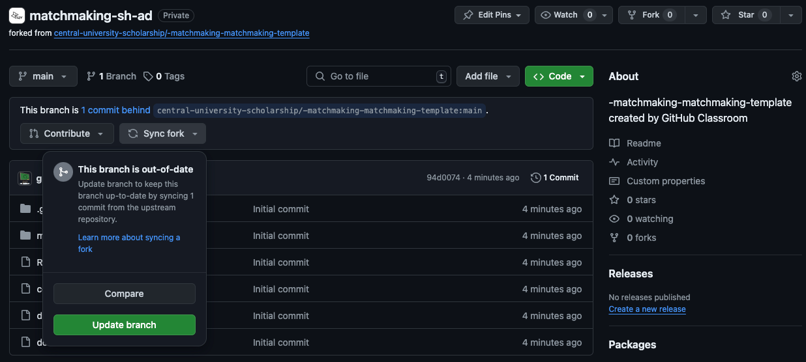

# Описание

Представь, что ты разработчик игры, в которой сталкиваются две команды из пяти игроков. Каждая команда состоит из пяти
ролей: верхняя (top), средняя (mid), нижняя (bot), поддержка (sup), лес (jungle).

### Задача

Создать сервис, который бы подбирал игроков в команду на основе их предпочтений и MMR

Для этого вам нужно учитывать метрики:

- MМР — Matchmaking Rating (рейтинг игрока, полученный в процессе игры), числовой эквивалент навыков игрока;
- Проранжированный список позиций;
- Время ожидания в очереди.

### Оценивание

Тестирующая система оценивает:

- Честность матча (шансы победить должны быть 50%±1%);
- Предпочитаемые позиции (игроки ранжируют позиции наиболее комфортным для себя образом);
- Скорость поиска (игроки не должны быть в очереди слишком долго).

### Тестирование

- Задание должно выполняться в отдельной ветке, например, ``develop``, тесты запускаются при создании Pull Request в
  ветку ``main``
- Запуски тестов можно посмотреть во вкладке Actions, важно, чтобы к моменту сдачи они прохродили успешно т.е. были "
  зеленые"
-

#### Локальное тестирование

- Для локального тестирования вам нужно установить [Podman](https://podman.io/)
  или [Docker](https://www.docker.com/products/docker-desktop)

# [Документация](docs/docs.md)

# Схема взаимодействия

1) Отправляете GET запрос на `/matchmaking/match` с параметрами `test_name` и `epoch`
2) Распределяете полученных пользователей по командам
3) Отправка POST запроса на `/matchmaking/match` с параметрами `test_name` и `epoch` и данными о командах. В ответе
   получаете `new_epoch`, который теперь используете в новых запросах
4) Повторяете пункты 1-3, пока `new_epoch` не будет равен `00000000-0000-0000-0000-000000000000`
5) Повторяете, пока не закончатся тесты

## Важно

- Вам нельзя ничего менять в папках `\.github` и `\server`, иначе работа будет анулирована
- Не обязательно распределять всех игроков по командам, но их должно остаться <= 9

# FAQ
1) Что делавть, если задание обновилось? 

Вам нужно нажать `Synk fork`, а дальше `Update branch`

